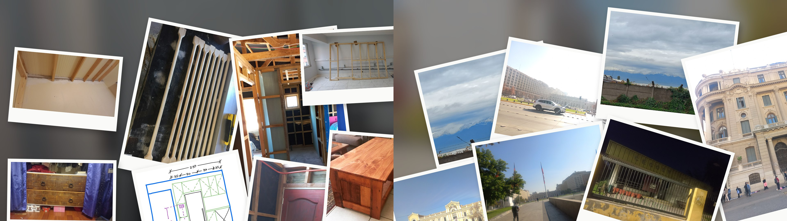
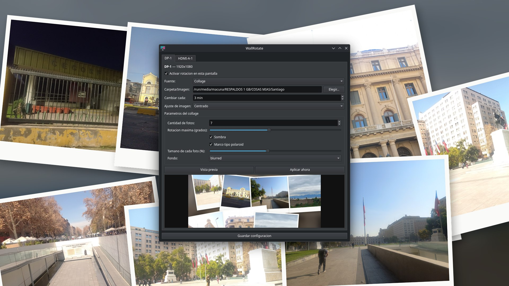
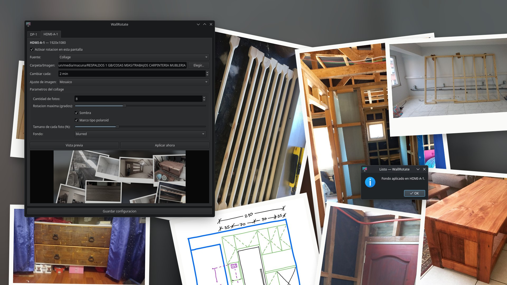

# WallRotate

Rotador de fondos de pantalla para KDE Plasma, con soporte de **collage
tipo "pila de fotos"** generado automáticamente a partir de tus propias
imágenes — configurable de forma independiente por cada monitor.

Nace como reemplazo de [John's Background Switcher](https://johnsad.ventures/software/backgroundswitcher/)
(Windows/macOS, sin versión Linux) para quienes quieren ese mismo efecto
de fotos "esparcidas" tipo polaroid en su escritorio Linux.






## Por qué existe esto

Hace años que me gusta tener de fondo de pantalla un collage con fotos de
mis hijas y de mis pasiones — arrancó armándolos a mano en Photoshop y
otros editores, foto por foto, cada vez que quería cambiarlo. En algún
momento encontré **John's Background Switcher** y fue un salto enorme:
automatizaba todo eso que hacía manualmente.

El problema llegó con el cambio definitivo a Linux: JBS es Windows/macOS
únicamente, y por más que busqué no encontré ningún reemplazo real para
KDE Plasma que hiciera ese mismo efecto de "pila de fotos". Así que,
con la ayuda de [Claude Code](https://claude.com/claude-code), terminé
armando el mío.

## Features

- **Por monitor**: cada pantalla conectada tiene su propio perfil independiente (detecta automáticamente cuántos monitores tenés).
- **Tres modos de fuente**:
  - Imagen fija.
  - Carpeta en modo slideshow (una foto a la vez, rotando).
  - **Collage**: compone varias fotos de una carpeta en una sola imagen, con marco tipo polaroid, sombra difusa, rotación aleatoria y fondo difuminado.
- **Intervalo configurable** por pantalla (en minutos).
- **Modo de ajuste de imagen**: rellenar, ajustar, estirar, centrado, mosaico.
- **Parámetros de collage ajustables**: cantidad de fotos, ángulo máximo de rotación, sombra on/off, marco on/off, tamaño relativo de cada foto, tipo de fondo (difuminado o color sólido).
- **Vista previa** antes de aplicar.
- **Rotación automática en segundo plano** vía `systemd --user timer`, no depende de que la app esté abierta.
- **Icono en la bandeja del sistema**: al cerrar o minimizar la ventana, sigue corriendo en segundo plano (click derecho para rotar ya mismo o salir de verdad).

## Instalación

Requiere Python 3.13+, [uv](https://docs.astral.sh/uv/), y KDE Plasma 6 (usa `qdbus6` y `kscreen-doctor`, ambos parte de Plasma).

```bash
git clone git@github.com:Cap-dutch/wallrotate.git
cd wallrotate
uv sync
```

Opcional, para poder lanzarlo como comando (`wallrotate`) y desde el menú de aplicaciones:

```bash
mkdir -p ~/.local/bin ~/.local/share/applications
ln -sf "$(pwd)/.venv/bin/wallrotate" ~/.local/bin/wallrotate
ln -sf "$(pwd)/.venv/bin/wallrotate-engine" ~/.local/bin/wallrotate-engine
cp packaging/wallrotate.desktop ~/.local/share/applications/
update-desktop-database ~/.local/share/applications
```

(`~/.local/bin` tiene que estar en tu `PATH`.)

## Uso

Abrir la GUI de configuración:

```bash
uv run wallrotate
```

Elegí, por cada pestaña (una por monitor detectado): la fuente (imagen /
carpeta / collage), la ruta, el intervalo, el modo de ajuste, y si es
collage, sus parámetros. "Vista previa" genera un preview sin aplicarlo;
"Aplicar ahora" lo aplica al toque; "Guardar configuración" persiste los
cambios para que el motor de rotación automática los use.

### Activar la rotación automática

```bash
systemctl --user daemon-reload
systemctl --user enable --now wallrotate.timer
```

El timer corre cada 1 minuto y decide, por cada pantalla, si ya se cumplió
su intervalo configurado. Ver logs:

```bash
journalctl --user -u wallrotate.service -f
```

## Arquitectura

```
src/wallrotate/
├── collage.py         # Generador de collage (Pillow): marco, sombra, rotación, fondo
├── plasma_bridge.py   # Detección de monitores y aplicación de wallpaper vía D-Bus/Plasma
├── config.py           # Perfiles por pantalla (JSON) + estado de rotación
├── engine.py           # Motor: decide y aplica el siguiente fondo por pantalla
└── app.py              # GUI de configuración (PySide6)
```

El wallpaper se aplica usando la API de scripting de Plasma
(`org.kde.PlasmaShell.evaluateScript` vía `qdbus6`), escribiendo
directamente la configuración del plugin `org.kde.image` para el
`desktop` correspondiente a cada pantalla — es el mismo mecanismo que usa
Plasma internamente, sin dependencias extra ni hacks sobre archivos de
configuración.

## Stack

Python 3.13 · [PySide6](https://doc.qt.io/qtforpython/) (GUI) ·
[Pillow](https://python-pillow.org/) (composición de imágenes) ·
`qdbus6` / `kscreen-doctor` (integración con Plasma) ·
`systemd --user` (rotación automática)

## Estado del proyecto

Funcional, en uso diario propio. Sin tests automatizados todavía.

### Pendientes conocidos

- Resolución del timer de 1 minuto — intervalos menores no aplican.
- No maneja hot-plug de monitores mientras la GUI está abierta.
- El modo de ajuste "mosaico" no está probado a fondo.

## Créditos

- **[John's Background Switcher](https://johnsad.ventures/software/backgroundswitcher/)**
  es la inspiración directa de este proyecto — el modo collage, el menú
  de bandeja con Siguiente/Anterior/Pausar, y la idea de rotar por
  carpeta salen de ahí. No comparte código (JBS es .NET cerrado, sin
  versión Linux), pero sin ese programa esto no existiría. Si usás
  Windows o macOS, es la opción más completa y madura.
- Desarrollado con [Claude Code](https://claude.com/claude-code).

## Licencia

[MIT](LICENSE) — usalo, copialo, modificalo, lo que quieras.
